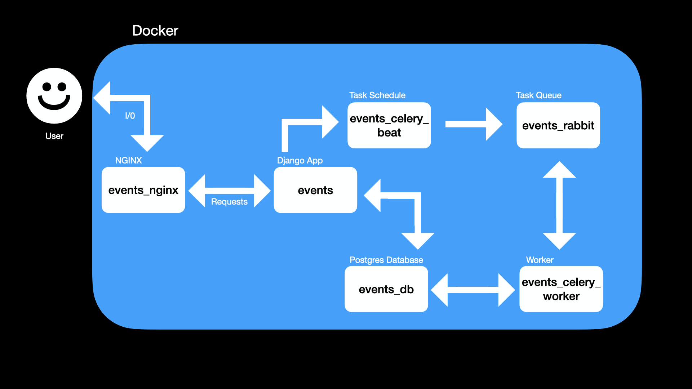
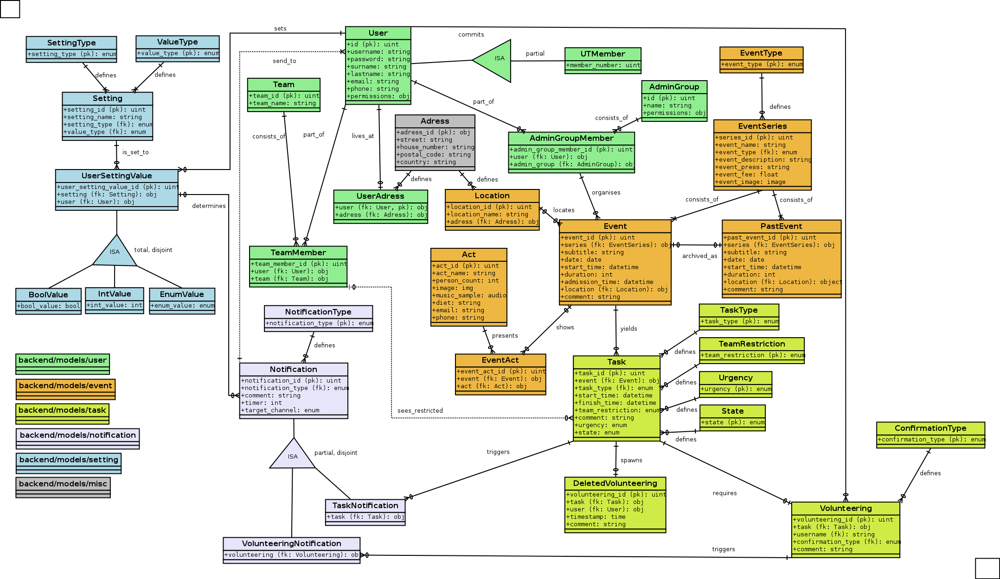

# event-management

Development repository for event management services.

## Live Demo

A live demo of the project can be found via following links:
- [admin panel](https://ut.johannesgge.de/admin/)
- [calendar view](https://ut.johannesgge.de/ecal/calendar/)

Login with: 
- `ut-admin/ut-admin` as non-superuser admin.
- `ut-user/ut-user` as non-admin user.


## Local-Docker-Dev-Setup
(*) *only needed for local IDE*

- (*) set up virtual env with Python 3.11 and Django 4.2
- clone into this repository
- (*) run `python3 -m pip install -r requirements.txt`
- run `docker compose up`
- run `docker exec events python3 manage.py makemigrations` & `docker exec events python3 manage.py migrate` to initialize local test db
- optionally run `docker exec events python3 manage.py addbasedata` & `docker exec events python3 manage.py addtestdata` to insert base and test data
- run `docker exec events python3 manage.py createsuperuser` to create admin user **fails due to: ``Superuser creation skipped due to not running in a TTY. You can run `manage.py createsuperuser` in your project to create one manually.``**
- run `docker exec -ti events /bin/bash` to open the events container with CLI (`/bin/sh` im deploy container)
- within the container: `python3 manage.py createsuperuser`
- open `http://0.0.0.0:8000/`

### general development links
- Admin Interface: `http://0.0.0.0:8000/admin/`
- RabbitMQ Interface: `http://localhost:15672/#/`
- Calendar: `http://0.0.0.0:8000/ecal/calendar/`
- Profile Page: `http://0.0.0.0:8000/profile/hub/`
- Logout: `http://0.0.0.0:8000/accounts/logout/`

### Print to docker console from any .py file
1. add `import logging` to the imports
2. instantiate logger: `logger = logging.getLogger(__name__)`
3. define output: `logger.error('some string '+str(some_variable))`
(currently only `logger.error` is shown, maybe due to local docker/logging config idk)

### Tests
Within the file `tests_user.py` in `/app/backend/tests` there are a few tests for the user creation methods:
- within the running events container enter:
- `python3 manage.py test backend.tests`
- [django docs: testing](https://docs.djangoproject.com/en/4.2/topics/testing/overview/)

## Docker Deployment

1. Clone
2. Add nginx-config to host (`event-management/nginx_deploy_server.conf`) and change domain
3. Adjust `event-management/app/.env`

## Project Structure
### Directory

tree view of relevant files and directories

***TBD UPDATE***
```
event-management/
├── LICENSE
├── OTHER
├── README.md
├── app
│   ├── backend
│   │   ├── admin.py
│   │   ├── apps.py
│   │   ├── forms.py
│   │   ├── management
│   │   │   └── commands
│   │   │       ├── addbasedata.py
│   │   │       └── addtestdata.py
│   │   ├── migrations
│   │   ├── models
│   │   │   ├── event
│   │   │   ├── misc
│   │   │   ├── notification
│   │   │   ├── setting
│   │   │   ├── task
│   │   │   └── user
│   │   ├── templates
│   │   │   ├── admin
│   │   │   │   └── base.html
│   │   │   ├── admin_change_pw.html
│   │   │   └── master.html
│   │   ├── tests
│   │   │   └── tests_user.py
│   │   ├── urls.py
│   │   └── views.py
│   ├── events
│   │   ├── asgi.py
│   │   ├── celery.py
│   │   ├── celery_tasks.py
│   │   ├── settings.py
│   │   ├── urls.py
│   │   └── wsgi.py
│   ├── events_calendar
│   │   ├── admin.py
│   │   ├── apps.py
│   │   ├── forms.py
│   │   ├── migrations
│   │   ├── models.py
│   │   ├── static
│   │   │   └── events_calendar
│   │   │       └── css
│   │   ├── templates
│   │   │   ├── events_calendar
│   │   │   │   ├── base.html
│   │   │   │   ├── calendar.html
│   │   │   │   ├── event.html
│   │   │   │   ├── past_event.html
│   │   │   │   └── task.html
│   │   │   └── registration
│   │   │       └── login.html
│   │   ├── tests.py
│   │   ├── urls.py
│   │   ├── utils.py
│   │   └── views.py
│   ├── manage.py
│   ├── profile_page
│   │   ├── admin.py
│   │   ├── apps.py
│   │   ├── forms.py
│   │   ├── migrations
│   │   ├── models.py
│   │   ├── static
│   │   │   └── profile_page
│   │   │       └── css
│   │   ├── templates
│   │   │   ├── profile_page
│   │   │   │   ├── account.html
│   │   │   │   ├── adress.html
│   │   │   │   ├── base.html
│   │   │   │   └── profile_hub.html
│   │   │   └── registration
│   │   │       └── login.html
│   │   ├── tests.py
│   │   ├── urls.py
│   │   └── views.py
│   ├── static
│   │   └── css
│   │       └── base.css
│   └── templates
│       └── base.html
├── data
├── docker-compose-deploy.yml
├── docker-compose.yml
├── dockerfiles
│   ├── Dockerfile_app
│   ├── Dockerfile_app_deploy
│   ├── Dockerfile_celery_beat
│   └── Dockerfile_celery_worker
├── nginx
│   ├── Dockerfile
│   ├── default.conf
│   └── uwsgi_params
├── nginx_deploy_server.conf
├── rabbitmq
│   ├── 20-logging.conf
│   ├── Dockerfile
│   └── init.sh
├── requirements.txt
└── scripts
    ├── celery_beat.sh
    ├── celery_worker.sh
    ├── django.sh
    └── entrypoint.sh
```

### Docker Setup 
general dependencies within docker (nginx only for deploy)

***TBD UPDATE***


### Framework

- [Django](https://docs.djangoproject.com): [4.2 LTS](https://www.djangoproject.com/download/)
- Very useful: [Django class based views descriptions](https://ccbv.co.uk)
- [Python: 3.11](https://docs.djangoproject.com/en/4.2/faq/install/#faq-python-version-support)
- [Bootstrap](https://pypi.org/project/django-bootstrap-v5/)
- [Postgres 16.3](https://hub.docker.com/_/postgres/)
- [RabbitMQ 3.13](https://hub.docker.com/_/rabbitmq)
- [Celery 5.4.0](https://docs.celeryq.dev/en/v5.4.0/)

### IDEF1X model for the backend data structure


## Frontend

[Collection of current frontend screenshots](OTHER/frontend.md)

## MVP checklist

- [x] Central database for all event related data.
- [x] Web service for database administration.
- [x] Web service for letting members of the UT-Connewitz select events where they want to participate.
