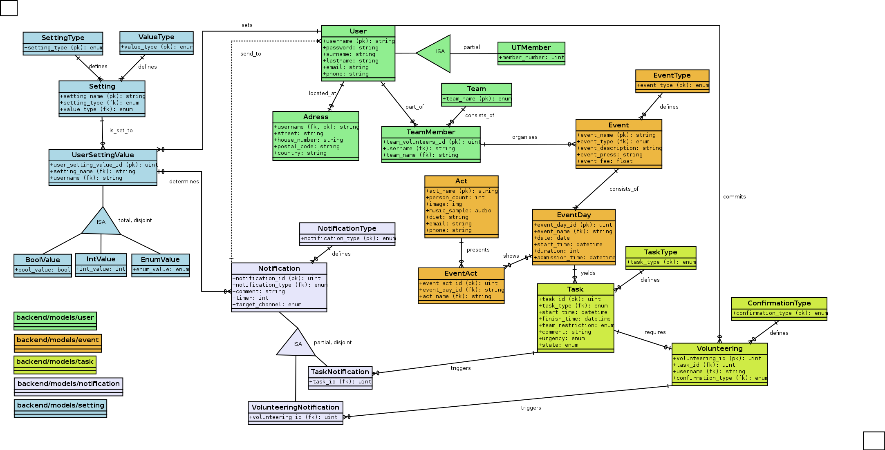

# event-management

Development repository for event management services.

## Overview
```
event-management/
├── Dockerfile
├── OTHER
│   ├── ERD_v2.png
│   ├── IDEF1X.dia
│   ├── IDEF1X.png
│   ├── plsql-scripts
│   ├── use-cases.md
│   └── ut_db_schema - Tabellenblatt1.csv
├── README.md
├── app
│   ├── backend
│   │   ├── __init__.py
│   │   ├── __pycache__
│   │   ├── admin.py
│   │   ├── apps.py
│   │   ├── management
│   │   │   ├── __init__.py
│   │   │   └── commands
│   │   ├── migrations
│   │   ├── models
│   │   │   ├── __init__.py
│   │   │   ├── __pycache__
│   │   │   ├── event
│   │   │   ├── notification
│   │   │   ├── setting
│   │   │   ├── task
│   │   │   └── user
│   │   ├── templates
│   │   │   └── master.html
│   │   ├── tests.py
│   │   ├── urls.py
│   │   └── views.py
│   ├── events
│   │   ├── __init__.py
│   │   ├── __pycache__
│   │   ├── asgi.py
│   │   ├── settings.py
│   │   ├── urls.py
│   │   └── wsgi.py
│   ├── manage.py
│   └── testbootstrap
├── data
│   └── db     
├── docker-compose.yml
└── requirements.txt
```

## TODO

- Central database for all event related data (partially done).
- Web service for database administration.
- Web service for letting members of the UT-Connewitz select events where they want to participate.
- Server deploy.


## Framework

- [Django](https://docs.djangoproject.com): [4.2 LTS](https://www.djangoproject.com/download/)
- [Python: 3.11](https://docs.djangoproject.com/en/4.2/faq/install/#faq-python-version-support)
- [Bootstrap](https://pypi.org/project/django-bootstrap-v5/)
- SQL: Postgres


## Local-Docker-Dev-Setup
(*) *only needed for local IDE*

- (*) set up virtual env with Python 3.11 and Django 4.2
- clone into this repository
- (*) run `python3 -m pip install -r requirements.txt`
- run `docker compose up`
- run `docker exec events python3 manage.py makemigrations` & `docker exec events python3 manage.py migrate` to initialize local test db
- optionally run `docker exec events python3 manage.py addbasedata` & `docker exec events python3 manage.py addtestdata` to insert base and test data
- run `docker exec events python3 manage.py createsuperuser` to create admin user **fails due to: `Superuser creation skipped due to not running in a TTY. You can run `manage.py createsuperuser` in your project to create one manually.`**
- run `docker compose exec events /bin/bash` to open the events container with CLI
- within the container: `python3 manage.py createsuperuser`
- open `http://0.0.0.0:8000/`

## Docker Deployment

1. Clone
2. create .env
3. Put the following
4. Change
```dotenv
DEBUG=False

POSTGRES_DB=postgres
POSTGRES_USER=postgres
POSTGRES_PASSWORD=postgres

ALLOWED_HOSTS=???????? #tbd
SECRET_KEY=samplesecret123
```

## IDEF1X model for the backend data structure

